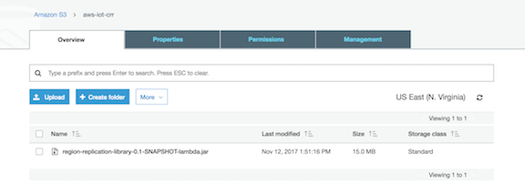
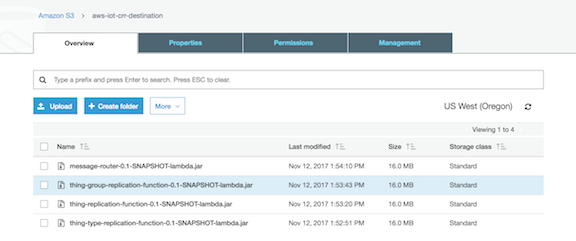

Cross Region Replication for IoT Registry
by Olawale Oladehin (oladehin@amazon.com)

This version is only for proof of concept.

# What are the prerequisites
* You need to be running JDK 8 and have Maven installed in order to build the binary files.
* You will need to create two S3 buckets one bucket is for the source region (where your IoT events will be generated), the second bucket will need to be created in your destination region (where your IoT events will be sent to)
* You will need to include the extra jar files (Kinesis Aggregator, Kinesis Deaggregator, and AWSIoTLaserJavaClient into your local maven repository in order to build the maven projects. To do this you'll need to run the following three commands:

`mvn install:install-file  -Dfile=/<path-to-project>/repo/KinesisAggregator-1.0.1.jar -DgroupId=com.amazonaws.services.kinesis -DartifactId=KinesisAggregator -Dversion=1.0.1 -Dpackaging=jar -DgeneratePom=true`

`mvn install:install-file  -Dfile=/<path-to-project>/repo/KinesisDeaggregator-1.0.1.jar -DgroupId=com.amazonaws.services.kinesis -DartifactId=KinesisDeaggregator -Dversion=1.0.1 -Dpackaging=jar -DgeneratePom=true`

`mvn install:install-file  -Dfile=/<path-to-project>/repo/AWSIotLaserJavaClient.jar -DgroupId=com.amazonaws -DartifactId=AWSIoTLaserJavaClient -Dversion=1.0 -Dpackaging=jar -DgeneratePom=true`

# Running the Code base
These are rough steps in getting the code up and running and testing replication

1) First, cd into the project directory (cd aws-iot-crr)
2) Run 'mvn clean package' in this directory to build the java lambda functions
3) Login to AWS, Navigate to the S3 and select your S3 bucket where your source region will be (this region must support AWS IoT). 
4) Upload the region replication jar file into your source S3. Your bucket will look similar to the below:

5) Next navigate to the S3 bucket in the destination region. In the destination S3 bucket, you'll copy the message router, thing group replication, thing replication, and thing type replication jar into the destination S3 bucket. Your bucket will look similar to the below:

6) Now that you're code is uploaded in both regions in S3, you can now deploy the separate CloudFormation templates. 

You'll deploy the `crr-source-region.yaml`, located in the cloudformation folder of the project, into the source region. 

 

You will need to provide the following values as input to the template:

	1. DestinationIoTRegion -- The region where devices, groups, and thing types will be replicated to
	2. DestinationKinesisStreamName -- There is one primary kinesis stream that sends events from one region to another. You decide the name of the stream here
	3. Replication Bucket -- The location of your source files which you uploade din step 4
	3. ReplicationLambdaFunctionKey -- The name of the jar file for your replication function. If you used `mvn clean package` this name can be kept as the default value

Then navigate to your destination region for replication and deploy the `crr-destination-region.yaml`, also located in the cloudformation folder of the project, into the destination region. 

 

	1. DestinationIoTRegion -- The region where devices, groups, and thing types will be replicated to
	2. DestinationKinesisStreamName -- There is one primary kinesis stream that sends events from one region to another. You decide the name of the stream here
	3. Replication Bucket -- The location of the source code for all of the destination processing logic. This is the same S3 bucket that you created in step 5
	3. MessageRouterFunctionS3Key, ThingGroupReplicationFunctionS3Key, ThingReplicationFunctionS3Key, and ThingTypeReplicationFunctionS3Key -- The name of the jar files for your replication functions for things, groups, and types. If you used `mvn clean package` this name can be kept as the default value

# Bugs / Limitations
* Still needs a lot more testing and code clean-up; this code is for a POC for region replication
* There was a bug in the Registry Events where the parentGroupName was not valid; this means that groups will replicate without hierarchy in the destination region. For example, a group hierarchy of USA > New York will be replicated as "USA" and a separate group with no parent of "New York". This was supposed to be fixed for GA but have not had the chance to revisit.
* This code currently does not replicate IoT policies or certificates. This could be added using JITP/JITR and BYOC. Any control plane changes to policies is not captured today though from the registry events.If you wish to implement you'll need to:

   1) Create an IoT rule that listens for JITR events
   2) Once the event is received push the event to a replication stream in the other region
   3) For any secondary region you will need to use BYOC mapping the CA cert in that region with the CA in the source region.
