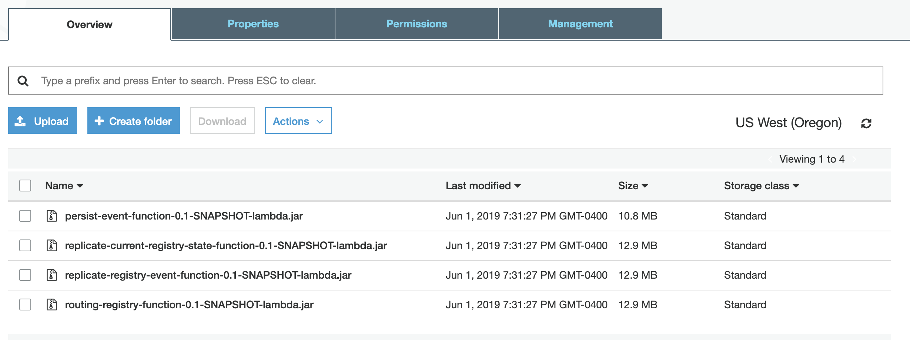
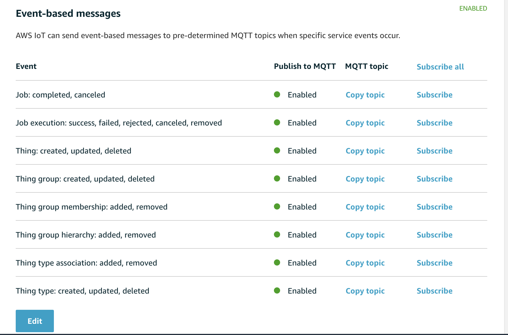
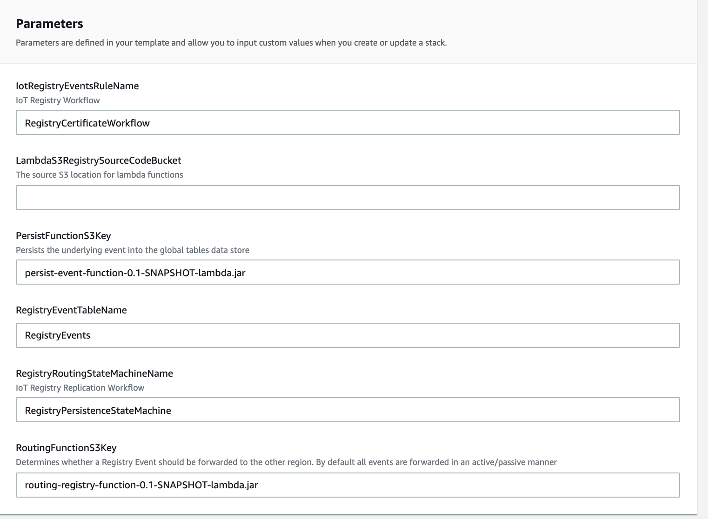
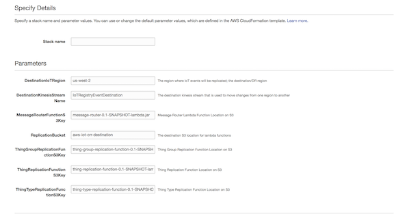
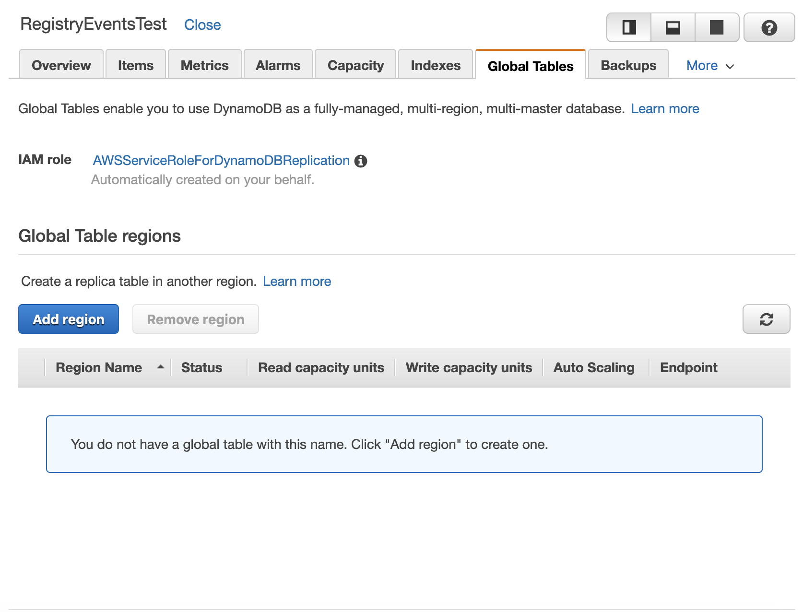
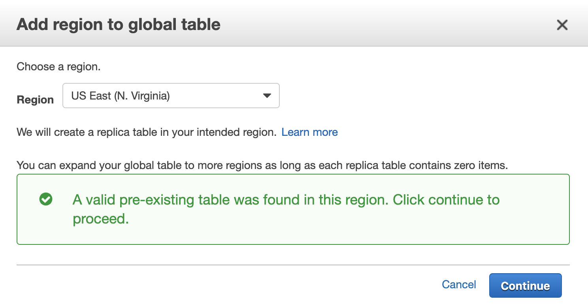

Cross Region Replication for AWS IoT Core Registry
by Olawale Oladehin (oladehin@amazon.com)

This version is only for proof of concept.

# What are the prerequisites
* You need to be running JDK 8 and have Maven installed in order to build the binary files.
* You will need to create two S3 buckets one bucket is for the source region (where your IoT events will be generated), the second bucket will need to be created in your destination region (where your IoT events will be replicated to the destination registry)

# Running the Code base
These are rough steps in getting the code up and running and testing replication

1) First, cd into the base cross region replication directory (cd aws-iot-crr/registry-routing-workflow)
2) Run 'mvn clean package' in this directory to build the java lambda functions
3) Login to AWS, Navigate to the S3 and select your S3 bucket where your source region will be (this region must support AWS IoT). 
4) Upload  all of the individual jar files into your source S3. Your bucket will look similar to the below:

5) Next navigate to the S3 bucket in the destination region. In the destination S3 bucket, you'll copy all the same jar files into the destination S3 bucket

6) Now that you're code is uploaded in both regions in S3, you can enable AWS IoT Registry Events. Registry Events are responsible for sending IoT messages whenever there is a change in the IoT Registry. Go the AWS IoT Core Console page, then select "Settings" at the bottom left of the page, and go to the "Event-based messages", select "Edit" and enable Messages for all event types. Once complete your settings section should look similar to the below:

7) You can now deploy the first CloudFormation in the source region. You'll deploy the `registry-persistence-lambda-functions.yaml`, located in the cloudformation folder of the project, into the source region in cloudformation. The persistence cloudformation file is responsible for setting up an IoT Rule that listens for Registry Events, then persisting those changes into DynamoDB through a simple Step Functions Workflow. After the message is persisted, the event will be streamed through DynamoDB Global Tables to the secondary region.

In your CloudFormation template, you will need to enter at a minimum the S3 bucket for your source location. If you've changed or modified any of the names for your Lambda Functions, wish to use a different name for DynamoDB or Step Functions, you may also need to update those fields in your CloudFormation Parameters:

 

8) Next navigate to your destination region you are using for replication and deploy the second CloudFormation file named `registry-replication-lambda-function.yaml`, also located in the cloudformation folder of the project, into the destination region. This CloudFormation Template deploys a single Lambda Function that will listen to the DynamoDB Global Tables and apply the changes to your destination region. It is important that your DynamoDB Table name used in this region is identical to the field used in the source region.

 

9) Once both regions have been configured, the last step before testing the replication is to enable Global Tables. The benefit of enabling Global Tables is that AWS is automatically take care of replicating the data from our source region to our destination region. Go to DynamoDB in either the source or destination region, select the DynamoDB table that you created using the cross region CloudFormation template, then select the Global Tables table, then select "Add region", and select the region where your other DynamoDB table is deployed. 

 

DynamoDB will recognize that this table has been created and already enabled and will associate it to the Global Table.

 

With all systems in place, you can test the replication of your IoT Registry by selecting your source region, then selecting AWS IoT. From here you can create Things, Groups, or Thing Types and those values will be replicated to your destination region. In addition you can associate Things to Thing Types or Things to Thing Groups and those associations are also replicated across region. 